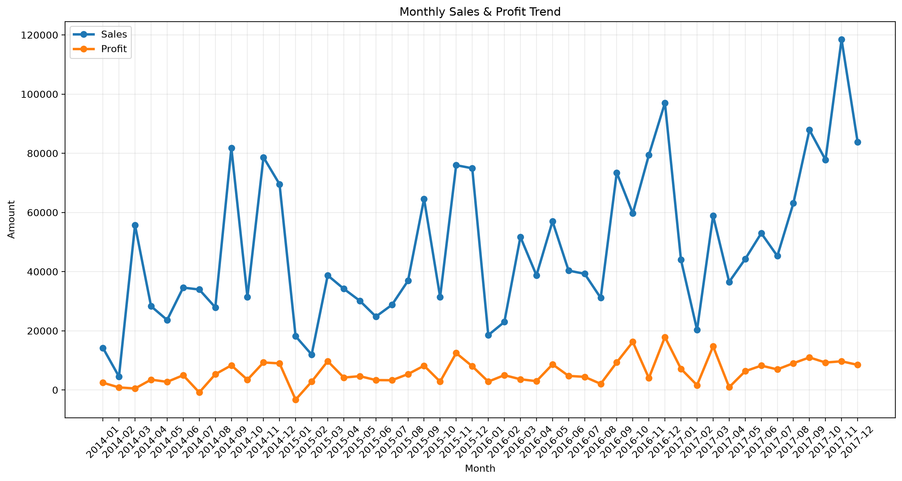
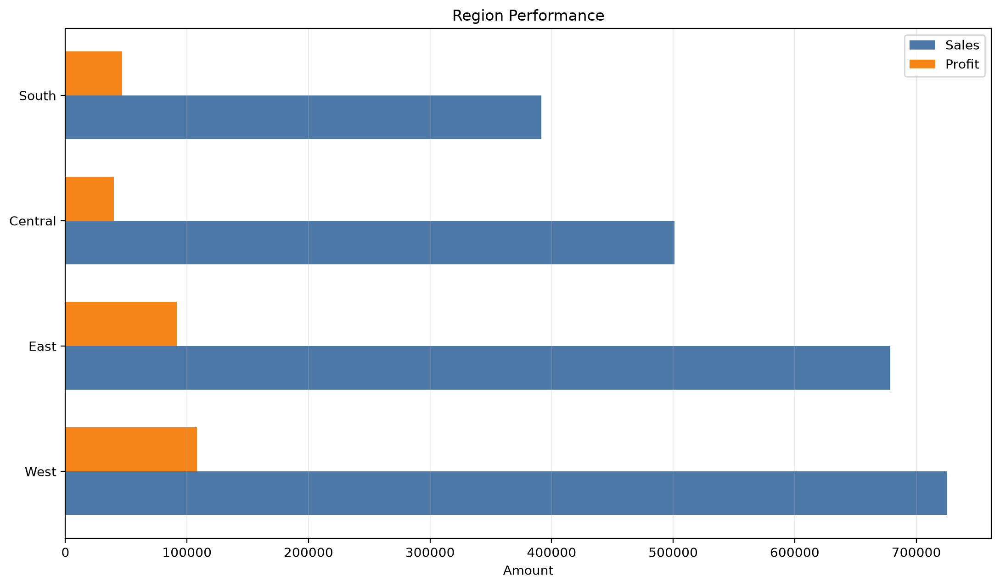
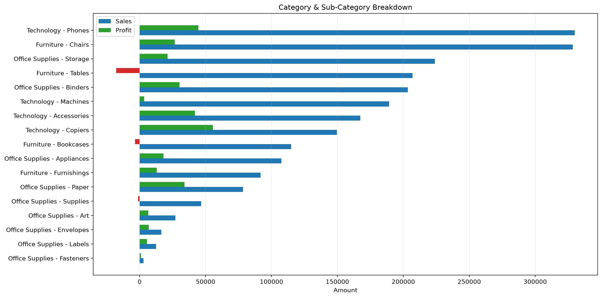
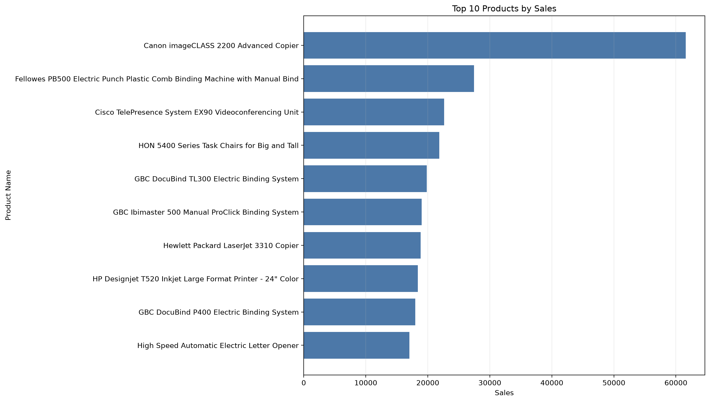
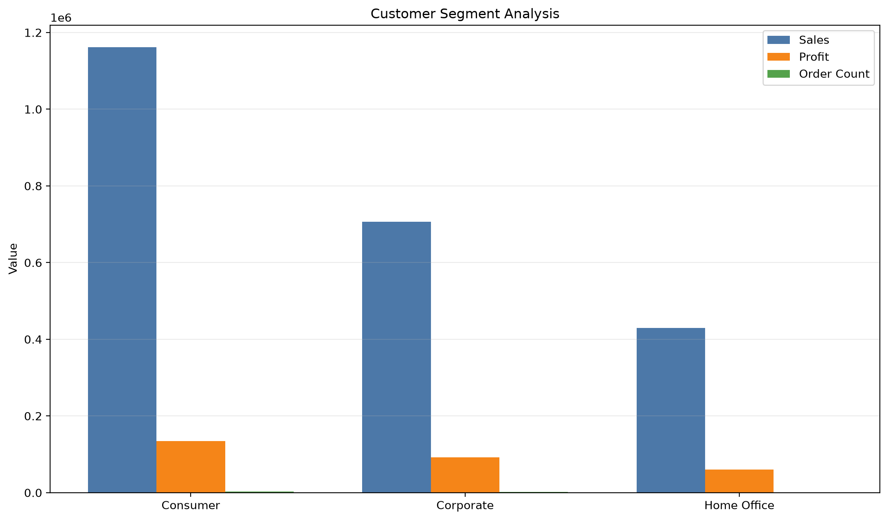
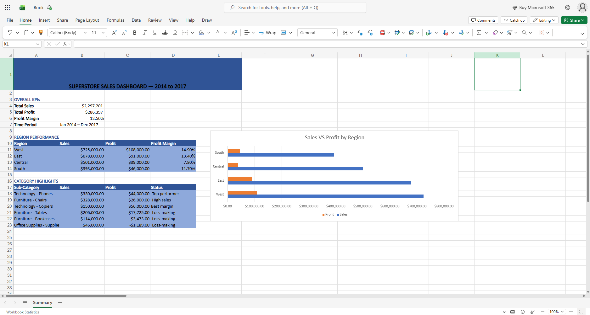

# Superstore Sales Analytics

Professional sales analytics project built from the Superstore sample dataset. The project combines Python-based analysis, chart generation, and PDF reporting to deliver a management-ready view of sales, profit, region performance, customer segments, and product concentration.

## Project Overview

This repository contains a complete analysis workflow for the Superstore dataset:

- `analysis.py` loads and prepares the data, creates the core visualizations, and prints the headline KPIs.
- `report.py` compiles the generated charts into a PDF report.
- `Superstore_Sales_Analytics_Report.md` provides a polished business narrative version of the findings.

## Dataset

The analysis uses `data/Sample - Superstore.csv`, which includes order, customer, geography, product, and financial details.

Key fields used in the analysis include:

- Order Date and Ship Date
- Region, Category, and Sub-Category
- Product Name and Segment
- Sales, Quantity, Discount, and Profit

## Deliverables

Running the workflow produces the following outputs in the `output/` folder:

- `01_monthly_sales_profit_trend.png`
- `02_region_performance.png`
- `03_category_subcategory_breakdown.png`
- `04_top_10_products_by_sales.png`
- `05_customer_segment_analysis.png`
- `Superstore_Sales_Report.pdf`

## Output Showcase

The report generates the following visuals and document artifacts.

### Monthly Sales & Profit Trend



### Region Performance



### Category & Sub-Category Breakdown



### Top 10 Products by Sales



### Customer Segment Analysis



### Excel Sheet Report Summary 


### PDF Report

[View the generated report](output/Superstore_Sales_Report.pdf)

## Requirements

The project uses the following Python libraries:

- pandas
- matplotlib
- openpyxl

## How to Run

1. Install the required packages.

   ```bash
   pip install pandas matplotlib openpyxl
   ```

2. Generate the charts and KPI summary.

   ```bash
   python analysis.py
   ```

3. Build the PDF report.

   ```bash
   python report.py
   ```

## Report Summary

The analysis covers:

- Monthly sales and profit trends
- Regional performance comparisons
- Category and sub-category profitability
- Top 10 products by sales
- Customer segment contribution

## Project Structure

```text
superstore_dashboard/
|-- data/
|   `-- Sample - Superstore.csv
|-- output/
|-- analysis.py
|-- report.py
|-- Superstore_Sales_Analytics_Report.md
`-- README.md
```

## Notes

- The CSV is read using `latin-1` encoding.
- Dates are parsed from `Order Date` and `Ship Date`.
- The analysis creates a `Month` field and a `Profit Margin` field for reporting purposes.

## Output Snapshot

After a successful run, the project provides a concise executive summary of total sales, total profit, profit margin, and total orders, along with a PDF report suitable for sharing with management.
